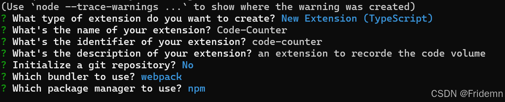
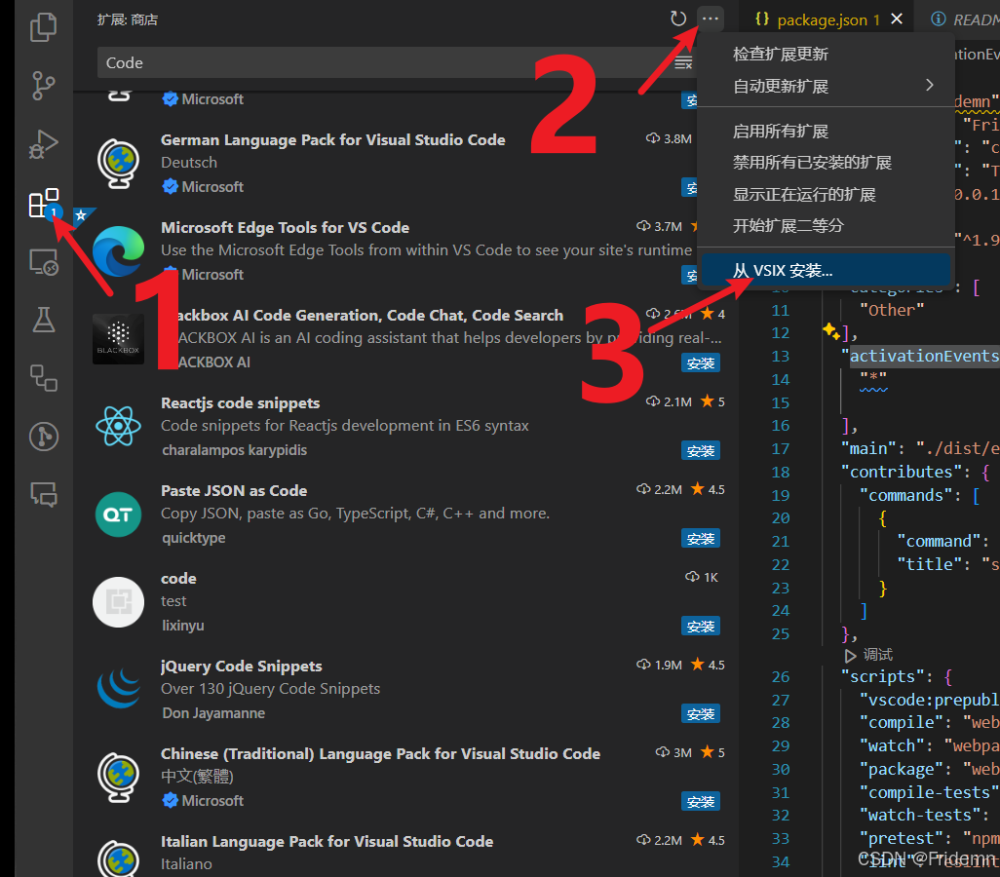

# Wasm-lang 

## 关于
RSIC MCU（Reduced Instruction Set Computing Microcontroller Unit）Assembly language highlighting

After installation is complete, click on set color theme
    

## build
### 创建项目

1. yo code 
### 安装项目依赖
2. npm install 
### 安装vsce
3. npm install @vscode/vsce -g --save vsce
### 打包
4. @vscode/vsce package
### 安装
后缀名为.vsix 
本地安装

### 注册账号上传
5. vsce publish

### vsce指令未识别时候执行下面指令 / 网上查找解法
Set-ExecutionPolicy RemoteSigned

## 版本

<!--Users appreciate release notes as you update your extension.-->

### 1.0.0

Initial release of Wasm-lang

## 开源地址
* [Gitee](https://gitee.com/wflwang/Wasm-lang)
* [Github](https://github.com/wflwang/Wasm-lang)

